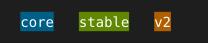

# A flex row with gap and colored items

display:flex, gap, and per-item background-color, the shape of a tag list or status strip.

## Input

```html
<div style="display:flex; gap:1">
<span style="background-color:#005f87;color:#ffffff;padding-left:1;padding-right:1">core</span>
<span style="background-color:#5f8700;color:#ffffff;padding-left:1;padding-right:1">stable</span>
<span style="background-color:#af5f00;color:#ffffff;padding-left:1;padding-right:1">v2</span>
</div>
```

## Output

Plain text, character-exact including wrapping and borders:

```text
 core   stable   v2   
```

With color and style:


