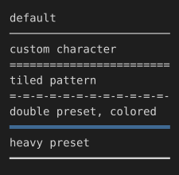

# Styling the hr rule

hr is an ordinary bordered block box with only border-top set (CSS.md): a quoted character, a multi-character pattern tiled to the box's exact width, and border-top's per-edge preset form for a themed line. border-style itself only reaches hr's corners here, not its default character, since the UA stylesheet already claims border-top.

## Input

```html
<div>default</div>
<hr>
<div>custom character</div>
<hr style="border-top: '='">
<div>tiled pattern</div>
<hr style="border-top: '=-'">
<div>double preset, colored</div>
<hr style="border-top: double; border-top-color: #5fafff">
<div>heavy preset</div>
<hr style="border-top: heavy">
```

## Output

Plain text, character-exact including wrapping and borders:

```text
default
────────────────────────
custom character
========================
tiled pattern
=-=-=-=-=-=-=-=-=-=-=-=-
double preset, colored
════════════════════════
heavy preset
━━━━━━━━━━━━━━━━━━━━━━━━
```

With color and style:


