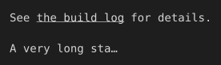

# OSC 8 hyperlinks and text-overflow

a link renders as a real OSC 8 terminal hyperlink, clickable in a supporting terminal, and text-overflow:ellipsis truncates a fixed-width cell instead of wrapping it.

## Input

```html
<p>See <a href="https://example.com/ci/run/482">the build log</a> for details.</p>
<table style="border-spacing:0"><tr><td style="white-space:nowrap; text-overflow:ellipsis; width:16">A very long status message</td></tr></table>
```

## Output

Plain text, character-exact including wrapping and borders:

```text
See the build log for details.

A very long sta…
```

With color and style:


