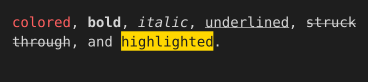

# Inline text styling

color, background-color, font-weight, font-style, and text-decoration on inline elements.

## Input

```html
<p><span style="color:#ff5f5f">colored</span>, <b>bold</b>, <i>italic</i>, <u>underlined</u>, <s>struck through</s>, and <span style="color:#1e1e1e;background-color:#ffd700">highlighted</span>.</p>
```

## Output

Plain text, character-exact including wrapping and borders:

```text
colored, bold, italic, underlined, struck
through, and highlighted.

```

With color and style:


