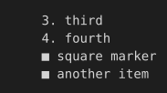

# Lists

list-style-type on an ordered and an unordered list, including a custom start value.

## Input

```html
<ol start="3">
<li>third</li>
<li>fourth</li>
</ol>
<ul style="list-style-type:square">
<li>square marker</li>
<li>another item</li>
</ul>
```

## Output

Plain text, character-exact including wrapping and borders:

```text
    3. third
    4. fourth
    ■ square marker
    ■ another item
```

With color and style:


