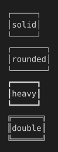

# Named border-style presets

border-style is a terminal-native extension (CSS.md), not a real CSS keyword set: solid, rounded, heavy, and double each pick a different box-drawing character set.

## Input

```html
<table style="border-style:solid; border-spacing:0"><tr><td>solid</td></tr></table>
<table style="border-style:rounded; border-spacing:0"><tr><td>rounded</td></tr></table>
<table style="border-style:heavy; border-spacing:0"><tr><td>heavy</td></tr></table>
<table style="border-style:double; border-spacing:0"><tr><td>double</td></tr></table>
```

## Output

Plain text, character-exact including wrapping and borders:

```text
┌─────┐
│solid│
└─────┘
╭───────╮
│rounded│
╰───────╯
┏━━━━━┓
┃heavy┃
┗━━━━━┛
╔══════╗
║double║
╚══════╝
```

With color and style:


