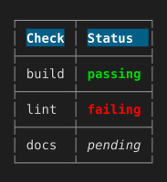

# A table with a colored header row

border-collapse:collapse plus per-cell border and padding, and background-color/color on the header cells, the pattern a status table or changelog commonly wants.

## Input

```css
table { border-collapse: collapse; }
th, td { border: 1px solid #888888; padding-left: 1; padding-right: 1; }
th { color: #ffffff; background-color: #005f87; }
```

```html
<table>
<tr><th>Check</th><th>Status</th></tr>
<tr><td>build</td><td style="color:#00d700;font-weight:bold">passing</td></tr>
<tr><td>lint</td><td style="color:#ff0000;font-weight:bold">failing</td></tr>
<tr><td>docs</td><td style="font-style:italic">pending</td></tr>
</table>
```

## Output

Plain text, character-exact including wrapping and borders:

```text
┌───────┬─────────┐
│ Check │ Status  │
├───────┼─────────┤
│ build │ passing │
├───────┼─────────┤
│ lint  │ failing │
├───────┼─────────┤
│ docs  │ pending │
└───────┴─────────┘
```

With color and style:


